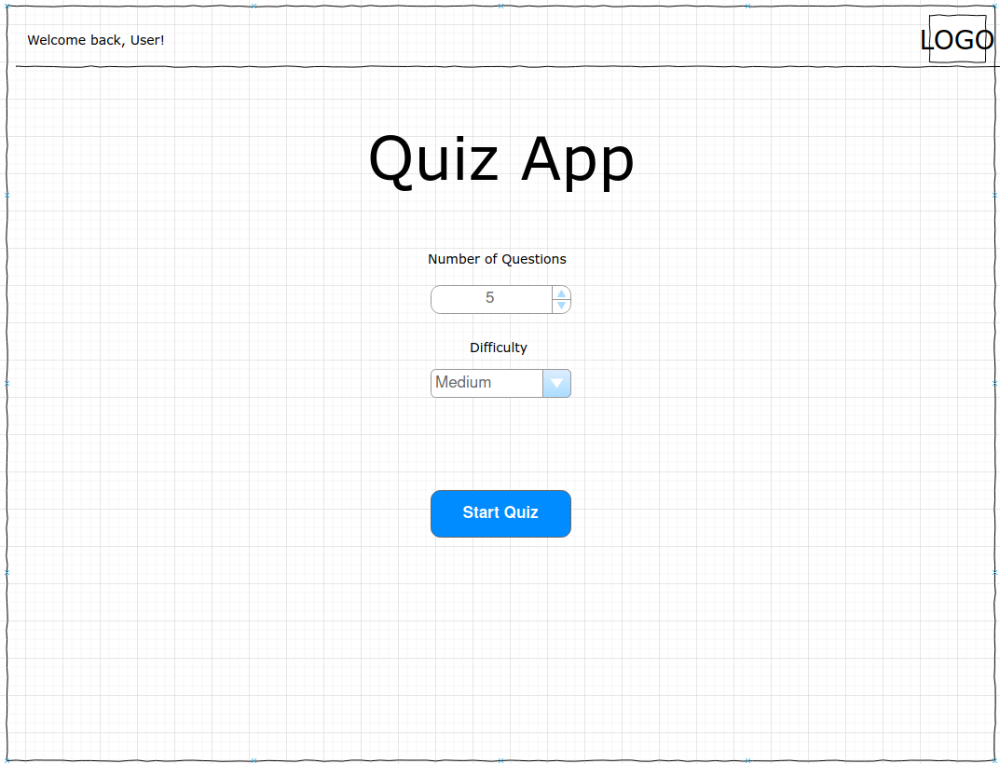
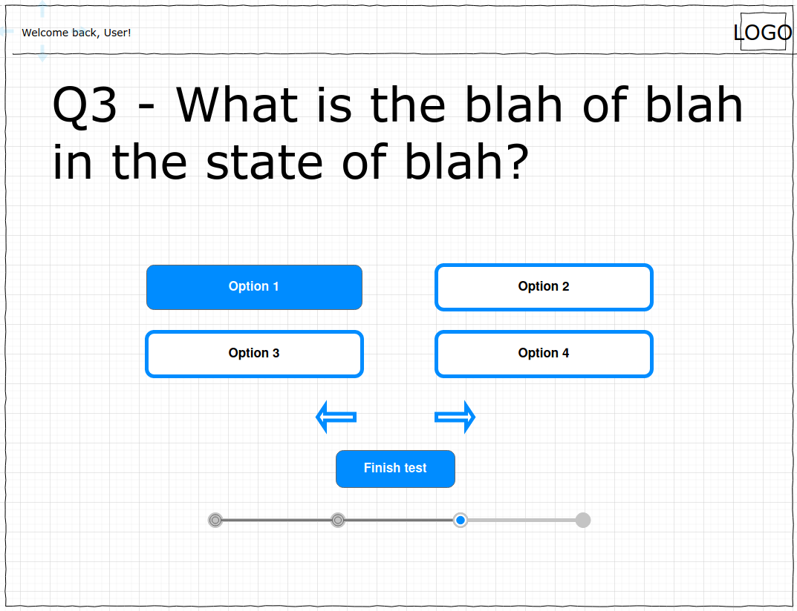
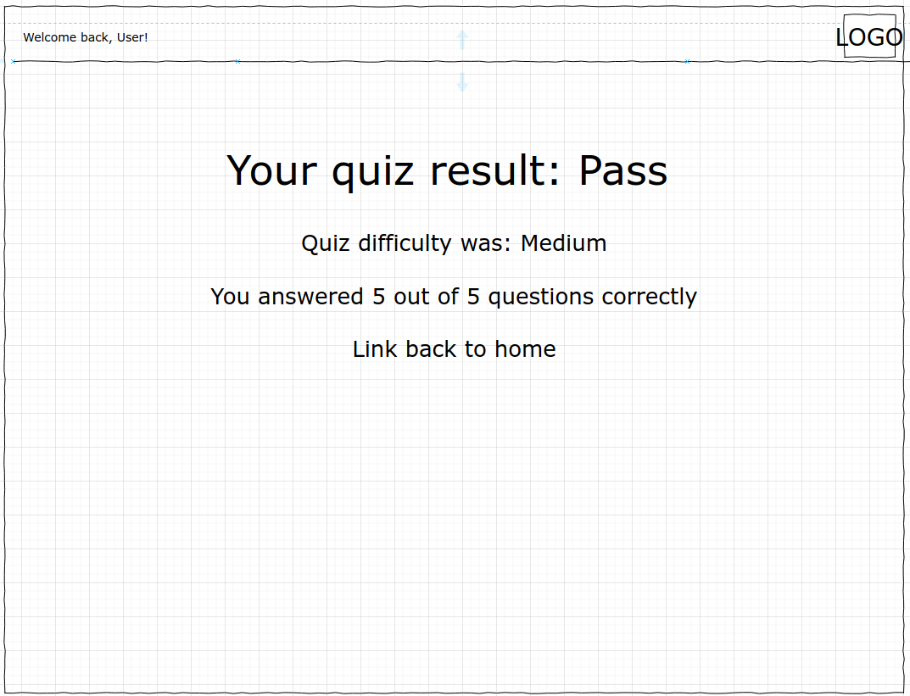
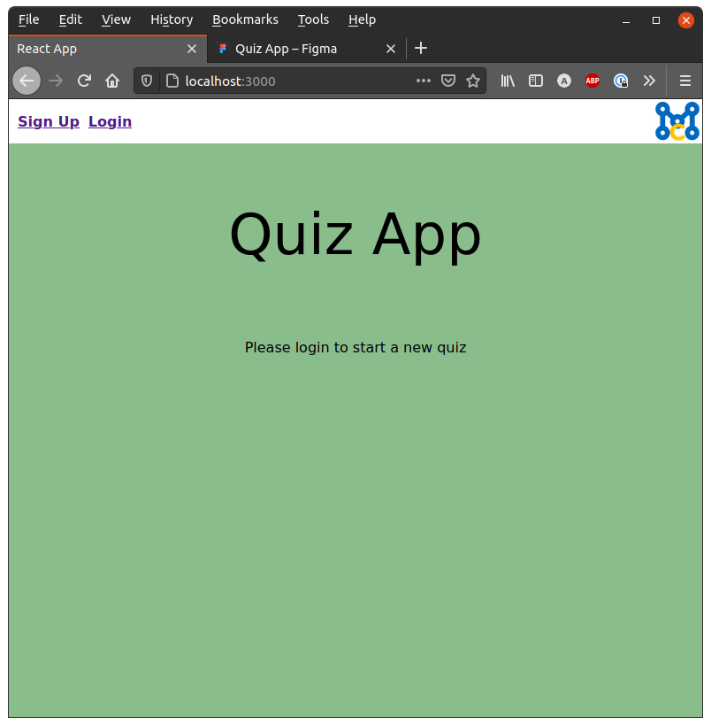
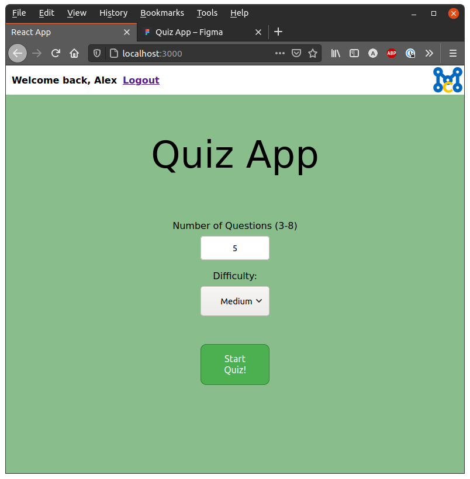
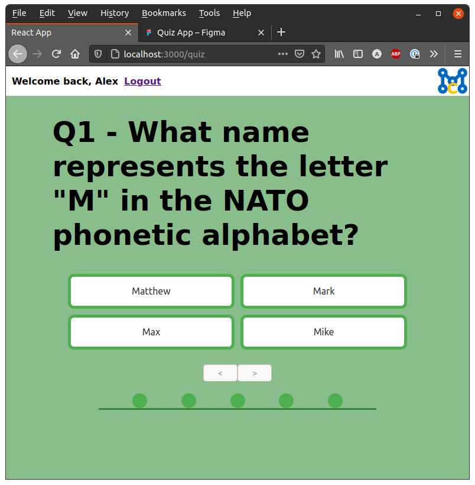
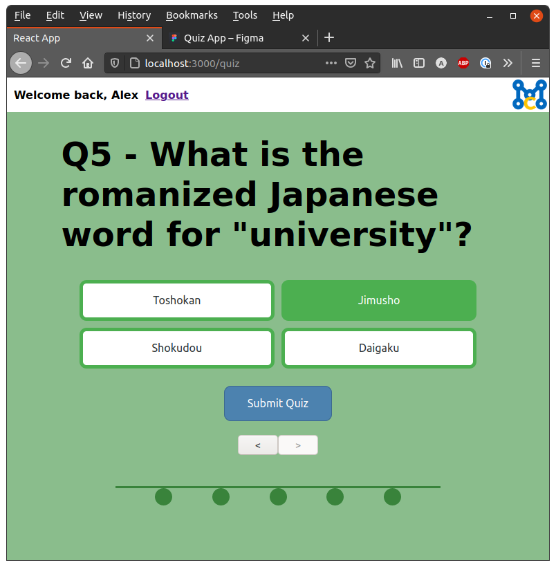
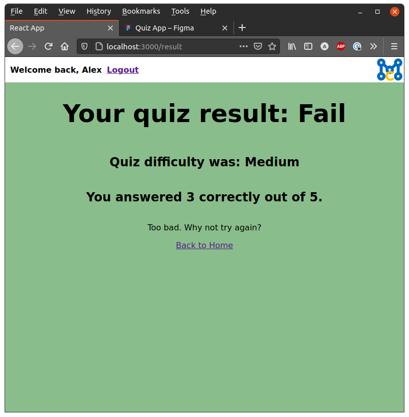

# Quiz App

## Introduction

This is a simple quiz application made for a 7 day assignment issued as part of an application for a developer position at [ManezCo](https://www.manezco.com/). 

## Features

The app starts with a form asking you to select the number of questions and the difficulty you desire. On submit, a quiz is fetched and the user is presented with a series of questions each with four possible answers. One question is answered after another, only proceeding if the latest question has been answered. Previously answered questions can be navigated back and forward between with navigation buttons.

Once all questions have been answered, the user can submit their answers and be taken to a results page which will inform them of their pass or fail status, the difficulty they attempted and the number of questions answered correctly. A link to the home screen will take the user back to the start where they can generate a new quiz.

## Run Instructions

In a terminal in the root directory, run `npm install` to install dependencies, then run either `npm run start` or `yarn start` to run the app on `http://localhost:3000/`.

## Troubleshooting

This app relies on the [Open Trivia DB API](https://opentdb.com) for the quiz data and thus, there is the possibility of failure to fetch from a third party. On fetching the data, a response code is console logged. From the OpenTDB docs, the code responses are as followed:

> - Code 0: Success Returned results successfully.
> - Code 1: No Results Could not return results. The API doesn't have enough questions for your query. (Ex. Asking for 50 Questions in a Category that only has 20.)
> - Code 2: Invalid Parameter Contains an invalid parameter. Arguements passed in aren't valid. (Ex. Amount = Five)
> - Code 3: Token Not Found Session Token does not exist.
> - Code 4: Token Empty Session Token has returned all possible questions for the specified query. Resetting the Token is necessary.

## Wireframes

## Screenshots

The home page before the user has logged in.

The home page after the user has logged in.

The quiz page after initial load.

The quiz page half way through a quiz.

The quiz page after all questions have been answered.

The quiz result page.
